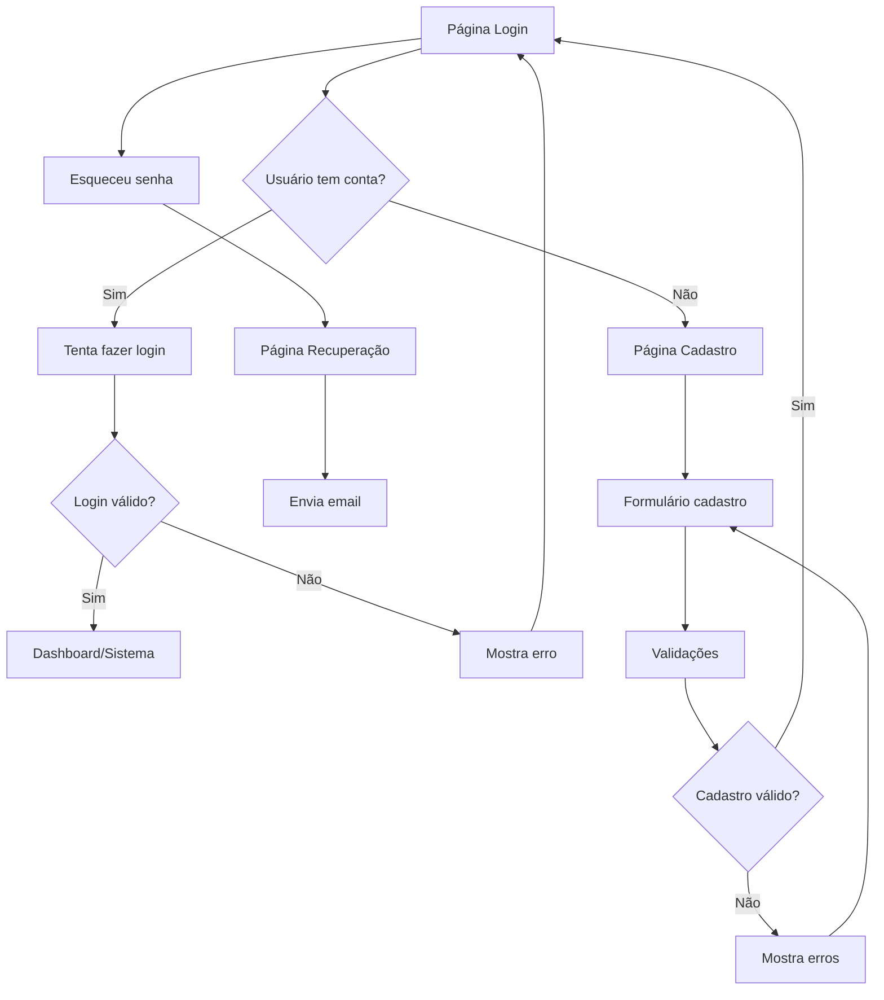

## 1. Visão Geral do Produto
Sistema de autenticação com interface de login e cadastro seguindo o design da FourTek. O produto resolve o problema de acesso seguro aos sistemas da empresa, permitindo que usuários se autentiquem de forma simples e intuitiva.

## 2. Funcionalidades Principais

### 2.1 Páginas do Sistema
Nosso sistema de autenticação consiste nas seguintes páginas principais:
1. **Página de Login**: formulário de autenticação, logo da empresa, links auxiliares
2. **Página de Cadastro**: formulário de registro de novos usuários
3. **Página de Recuperação de Senha**: formulário para redefinição de senha

### 2.2 Detalhes das Páginas
| Nome da Página | Módulo | Descrição das Funcionalidades |
|----------------|---------|------------------------------|
| Página de Login | Formulário de Login | Validação de email/senha, botão mostrar/ocultar senha, autenticação com backend |
| Página de Login | Área de Branding | Logo FourTek (verde/azul), subtítulo "SOLUÇÕES EM TI" |
| Página de Login | Links Auxiliares | Link "Esqueceu a senha?", ícones sociais (globo, instagram, facebook, linkedin) |
| Página de Login | Citação Footer | Texto motivacional "Se quer ter sucesso completo em sua vida, você tem que ser foda." |
| Página de Cadastro | Formulário de Registro | Nome completo, email com validação, senha com requisitos mínimos, confirmação de senha |
| Página de Cadastro | Validações | Validação em tempo real, feedback visual para campos inválidos |
| Página de Recuperação | Formulário de Recuperação | Campo de email para envio de link de redefinição |

## 3. Fluxo Principal do Usuário
O usuário acessa a página de login, pode optar por:
- Fazer login com credenciais existentes
- Criar uma nova conta (redirecionado para página de cadastro)
- Recuperar senha esquecida (redirecionado para página de recuperação)

## 4. Design da Interface

### 4.1 Estilo Visual
- **Cores primárias**: Verde (#00FF00) para "Four", Azul (#0066CC) para "Tek"
- **Cores de fundo**: Cinza muito claro para background, branco para cards
- **Estilo de botões**: Fundo verde, texto branco, cantos arredondados, largura total
- **Tipografia**: Sans-serif, peso médio/negrito para títulos, regular para texto
- **Layout**: Card centralizado com sombra suave, conteúdo alinhado à esquerda
- **Ícones**: Circulares, monocromáticos em cinza

### 4.2 Elementos por Página
| Página | Módulo | Elementos de UI |
|--------|---------|-----------------|
| Login | Card principal | Background cinza claro, card branco com bordas arredondadas e sombra |
| Login | Logo | Ícone abstrato verde + texto "Four" verde + "Tek" azul |
| Login | Formulário | Labels cinza escuro, inputs brancos com bordas cinza claras, cantos arredondados |
| Login | Botão | Verde vibrante, texto branco centralizado, hover effect |
| Login | Link | Texto azul, alinhado à direita abaixo do campo senha |
| Login | Footer | Ícones sociais espaçados, citação centralizada em cinza itálico |
| Cadastro | Formulário | Mesmo estilo do login, campos adicionais para nome e confirmação de senha |

### 4.3 Responsividade
Design desktop-first com adaptação para mobile. O card principal mantém proporções adequadas em diferentes tamanhos de tela, com campos e botões em largura total.