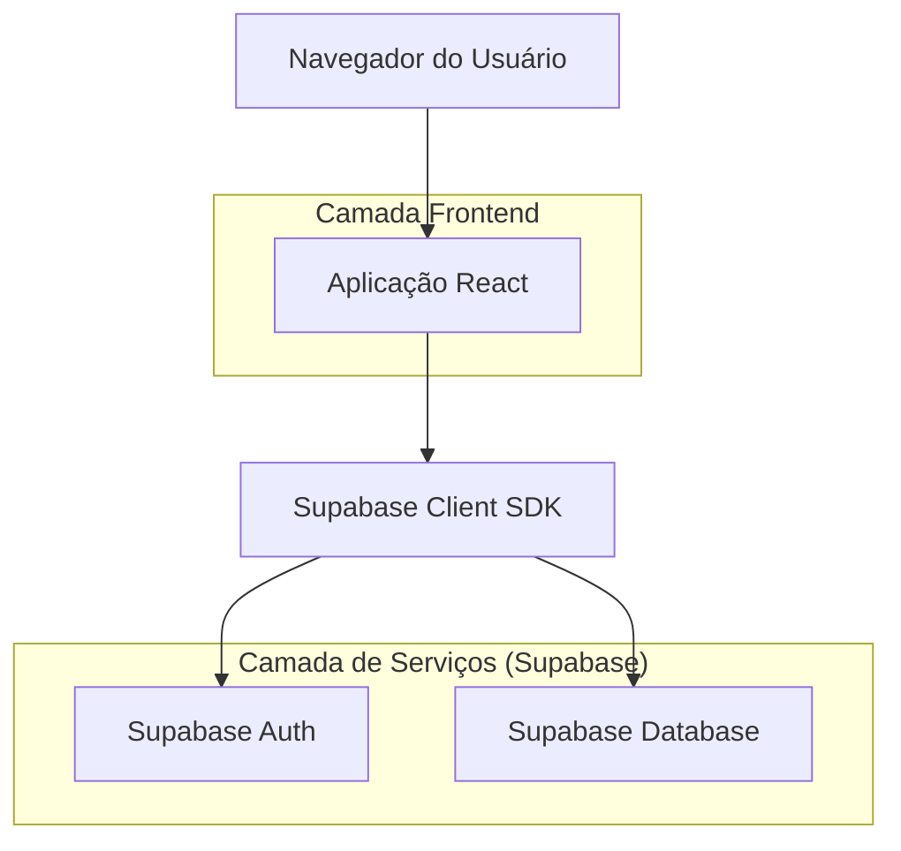
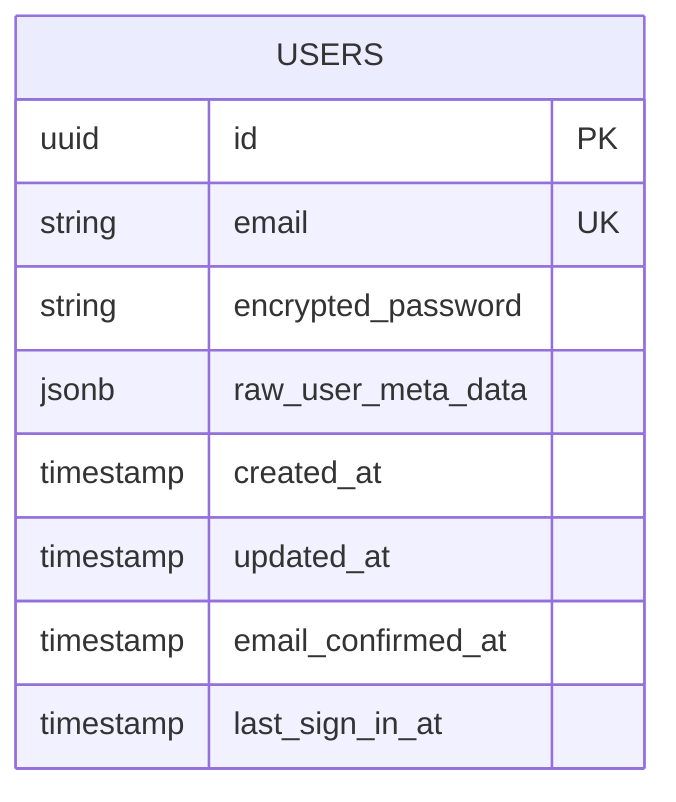

## 1. Arquitetura do Sistema



## 2. Descrição das Tecnologias
- Frontend: React@18 + tailwindcss@3 + vite
- Ferramenta de Inicialização: vite-init
- Backend: Supabase (Auth + Database)
- Bibliotecas adicionais: @supabase/supabase-js para autenticação

## 3. Definições de Rotas
| Rota | Propósito |
|------|-----------|
| /login | Página de login, formulário de autenticação |
| /register | Página de cadastro, formulário de registro |
| /forgot-password | Página de recuperação de senha |
| /dashboard | Página principal após login bem-sucedido |

## 4. Definições de API

### 4.1 Autenticação com Supabase

**Login de Usuário**
```javascript
// Client-side authentication
const { data, error } = await supabase.auth.signInWithPassword({
  email: userEmail,
  password: userPassword
})
```

**Registro de Novo Usuário**
```javascript
// Client-side registration
const { data, error } = await supabase.auth.signUp({
  email: userEmail,
  password: userPassword,
  options: {
    data: {
      full_name: fullName
    }
  }
})
```

**Recuperação de Senha**
```javascript
// Password reset
const { data, error } = await supabase.auth.resetPasswordForEmail(email)
```

## 5. Arquitetura do Servidor
Como estamos utilizando Supabase como backend-as-a-service, não há necessidade de servidor próprio. A autenticação é gerenciada diretamente pelo Supabase Auth.

## 6. Modelo de Dados

### 6.1 Definição do Modelo


### 6.2 Configuração do Supabase

**Políticas de Segurança (RLS)**
```sql
-- Enable Row Level Security
ALTER TABLE auth.users ENABLE ROW LEVEL SECURITY;

-- Grant basic read access to authenticated users
GRANT SELECT ON auth.users TO authenticated;

-- Grant full access to service role (for admin operations)
GRANT ALL PRIVILEGES ON auth.users TO service_role;
```

**Configurações de Autenticação**
- Email verification: Opcional (configurável)
- Password requirements: Mínimo 6 caracteres
- Session timeout: 1 hora (configurável)
- JWT expiration: 3600 segundos

## 7. Segurança
- **CSRF Protection**: Implementado via SameSite cookies e headers de segurança
- **Credenciais Seguras**: Senhas hasheadas com bcrypt no Supabase
- **Validação de Sessão**: Tokens JWT com validação automática
- **Rate Limiting**: Configurado no nível do Supabase para prevenir ataques de força bruta